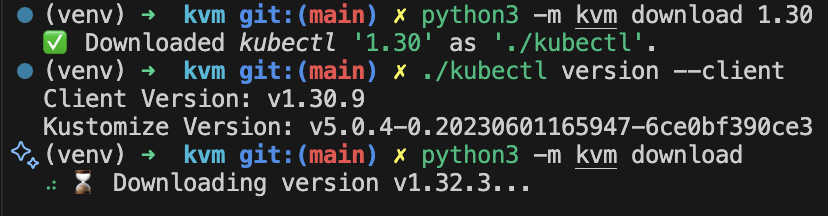

# kvm

*Kubectl Version Manager*: Seamlessly switch between multiple `kubectl` versions.


KVM by Dalle-2

## TL;DR

```python
python3 -m kvm download
```



## Index

- [kvm](#kvm)
  - [TL;DR](#tldr)
  - [Index](#index)
  - [Installation](#installation)
  - [Usage](#usage)
  - [Roadmap (TODOs)](#roadmap-todos)
  - [Development](#development)
    - [IDE](#ide)
    - [Package manager (dependencies)](#package-manager-dependencies)
    - [Prepare your environment](#prepare-your-environment)
    - [Pre-commit Hooks](#pre-commit-hooks)
    - [Unit Testing](#unit-testing)
    - [Building](#building)
      - [Binary/executable](#binaryexecutable)
      - [Using Pip instead of Uv](#using-pip-instead-of-uv)

## Installation

```python
uv pip install .
python3 -m kvm version
```

## Usage

To install a given version:

```python
python3 -m kvm install 1.32
```

The above will look for the latest path of v1.32, download (and cache) the binary and install it on PATH.

Or use the help flag to view all the options:

```python
python3 -m kvm --help
```

## Roadmap (TODOs)

1. Distribute over Pip.
2. Extend Unit Testing coverage.
3. Add feature to check installed kubectl version.

## Development

### IDE

If using Visual Studio Code, then go ahead and install the recommended Extensions (filter by `@recommended`).

### Package manager (dependencies)

This project uses [uv](https://docs.astral.sh/uv/guides/install-python/) as opposed to the customary `pip` because of the many advantages of the former (speed, managed virtual environments, managed python versions, clearer dependency management, etc).

You can still use `pip` instead of `uv`, in case you prefer it. Refer to [Using Pip instead of Uv](#using-pip-instead-of-uv).

### Prepare your environment

Create a Virtual Environment:

```bash
uv venv
source .venv/bin/activate
```

Install the dependencies:

```bash
uv sync
```

### Pre-commit Hooks

The [pre-commit](https://pre-commit.com/index.html#intro) framework is used to enforce certain validations on each commit, in the form of [Git Hook scripts](https://git-scm.com/book/en/v2/Customizing-Git-Git-Hooks).

Installation should be automatic upon commiting, but it can also be manually launched with `pre-commit install`. This uses scripts defined by tooling in their repositories (a `.pre-commit-hooks.yaml` definition file and a version Tag must exist), installs the dependencies as cache and adds the "pre/-commit" script to `.git/hooks`.

Hook execution should also be automatic, but to manually run them, `./.git/hooks/pre-commit` can be executed.

### Unit Testing

Run Pytest and calculate coverage:

```bash
pytest tests --cov=kvm
```

### Building

#### Binary/executable

Run:

```bash
pyinstaller -Fyn kvm --clean kvm/__main__.py
```

And find the output under `dist/kvm`. Make it executable:

```bash
chmod +x dist/kvm
```

Execute it as a binary:

```bash
kvm --help
```

#### Using Pip instead of Uv

```bash
uv export --format requirements.txt --no-dev --no-hashes > requirements.txt
uv export --format requirements.txt --only-dev --no-hashes > development.txt
pip install -r requirements.txt -r development.txt
```
