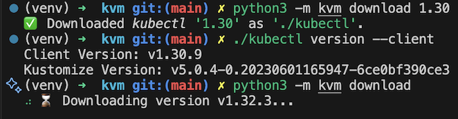

# kvm

*Kubectl Version Manager*: Seamlessly switch between multiple `kubectl` versions.


KVM by Dalle-2

## TL;DR

```python
python3 -m kvm download
```



## Index

- [kvm](#kvm)
  - [TL;DR](#tldr)
  - [Index](#index)
  - [Install](#install)
  - [Use](#use)
  - [TODOs](#todos)
  - [Development](#development)
    - [IDE](#ide)
    - [Prepare your environment](#prepare-your-environment)
    - [Pre-commit Hooks](#pre-commit-hooks)
    - [Unit Testing](#unit-testing)

## Install

```python
pip install .
python3 -m kvm version
```

## Use

```python
python3 -m kvm --help
```

## TODOs

1. Add installation to $PATH.
2. Build with Pyinstaller as executable.
3. Distribute over Pip.
4. Extend Unit Testing coverage

## Development

### IDE

If using Visual Studio Code, then go ahead and install the recommended Extensions (filter by `@recommended`).

### Prepare your environment

Create a Virtual Environment:

```bash
python -m venv venv
source venv/bin/activate
```

Install the dependencies:

```bash
pip install -r development.txt -r requirements.txt
```

### Pre-commit Hooks

The [pre-commit](https://pre-commit.com/index.html#intro) framework is used to enforce certain validations on each commit, in the form of [Git Hook scripts](https://git-scm.com/book/en/v2/Customizing-Git-Git-Hooks).

Installation should be automatic upon commiting, but it can also be manually launched with `pre-commit install`. This uses scripts defined by tooling in their repositories (a `.pre-commit-hooks.yaml` definition file and a version Tag must exist), installs the dependencies as cache and adds the "pre/-commit" script to `.git/hooks`.

Hook execution should also be automatic, but to manually run them, `./.git/hooks/pre-commit` can be executed.

### Unit Testing

Run Pytest and calculate coverage:

```bash
pytest tests --cov=kvm
```
